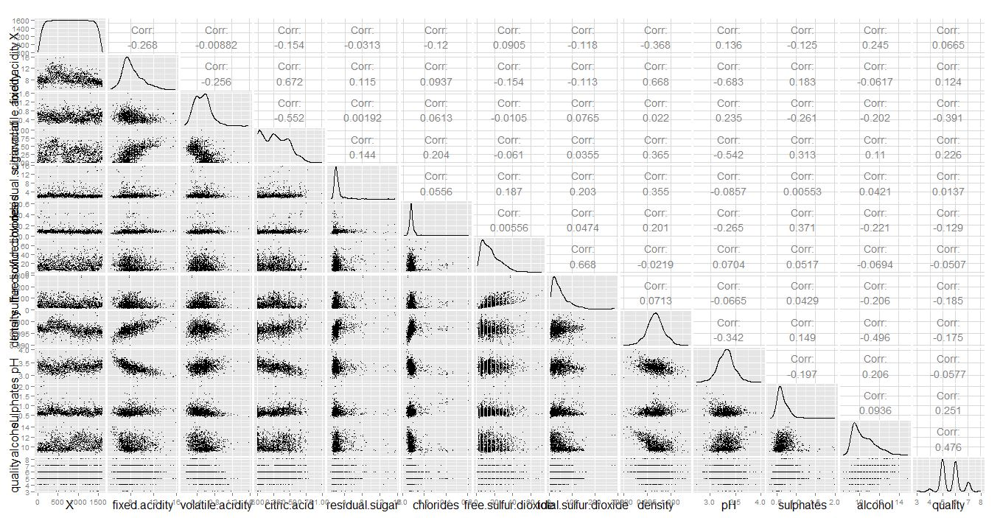

#Red Wine Quality Exploration By Anu Achankunju
#========================================================


##About

In this exercise, I will explore a data set on red wine quality and physicochemical
properties. The objective is to explore which chemical properties influence the 
quality of red wines. I'll start by exploring the data using the statistical 
program, R. As interesting relationships in the data are discovered, I'll produce
and refine plots to illustrate them. The data is available for download [here](https://www.google.com/url?q=https%3A%2F%2Fs3.amazonaws.com%2Fudacity-hosted-downloads%2Fud651%2FwineQualityWhites.csv&sa=D&sntz=1&usg=AFQjCNFUg-OvPk4mpLlkpW94LVA-BGpRlA "here")
and background information is available at this [link](https://s3.amazonaws.com/udacity-hosted-downloads/ud651/wineQualityInfo.txt "link").


_____________________________________________________________________________________________
##Summary Statistics

```{r echo=FALSE, message=FALSE, warning=FALSE, packages}
# Load all of the packages that you end up using
# in your analysis in this code chunk.

# Notice that the parameter "echo" was set to FALSE for this code chunk.
# This prevents the code from displaying in the knitted HTML output.
# You should set echo=FALSE for all code chunks in your file.

library(ggplot2)
library(dplyr)
library(GGally)
library(scales)
library(memisc)
library(reshape)
library(gridExtra)
```


```{r echo=FALSE, warning=FALSE}
###Load the Data from local directory containing wineQualityReds.csv
setwd('C:\\Users\\320002667\\Box Sync\\NanoDegree\\M3-Data Analysis with R\\Data')
wine_df<-read.csv('wineQualityReds.csv')
```

### What is the structure of your dataset?
Let's run some basic functions to examine the structure and schema of the 
data set.

Below table shows the dimension of the Red wine data frame in the format 
nrow X ncols
```{r echo=FALSE, warning=FALSE}
dim(wine_df)
```

The below table shows the different columns of the Red Wine date frame.
```{r echo=FALSE, warning=FALSE}
names(wine_df)
```

The below table shows the Red Wine data frame summary along with the basic 
statistics of each column in the data frame.
```{r echo=FALSE, warning=FALSE}
summary(wine_df)
```

The below table shows the internal structure of Red Wine data frame.
```{r echo=FALSE, warning=FALSE}
str(wine_df)
```
 

Some initial observations are:

* There are 1599 observations of 13 numeric variables.
* **X** appears to be the unique identifier.
* **Quality** is an ordered, categorical, discrete variable. From the literature, 
  this was on a 0-10 scale, and was rated by at least 3 wine experts. 
* All other variables seem to be continuous numeric values.
* From the variable descriptions, it appears that fixed.acidity, ~ volatile.acidity
  and free.sulfur.dioxide ~ total.sulfur.dioxide may possible by dependent, 
  subsets of each other.

### What is/are the main feature(s) of interest in your dataset?
We are  primarily interested in the feature **Quality** .It would  be interesting
to see basic statistics on quality as well. Below table shows the basis statistics
of feature quality.
```{r echo=FALSE, warning=FALSE}
summary(wine_df$quality)
```

Most wines have quality score of 5 or 6. The lowest quality is 3, and the highest
is 8. The mean alcohol is 10.42, the median of alcohol is 10.20.


```{r echo=FALSE }
# let's at least explore, clean up, and format the first two points.
# X
wine_df$X = factor(wine_df$X)
```

Let's table the feature quality.
```{r echo=FALSE }
# quality
table(wine_df$quality)

```

Assertion was correct here, so let's ensure the data frame semantically reflects
that.
```{r echo=FALSE}
wine_df$quality <- factor(wine_df$quality, ordered = T)
str(wine_df$quality)

```
_____________________________________________________________________________________________


##Univariate Plots
To first explore this data visually, histograms of all 12 variables are plotted
to see the  distribution of their values.
```{r echo=FALSE, warning=FALSE}
# exploratory, quick histogram plots
grid.arrange(qplot(wine_df$fixed.acidity)+xlab('Fixed Acidity'),
             qplot(wine_df$volatile.acidity)+xlab('Volatile Acidity'),
             qplot(wine_df$citric.acid)+xlab('Citric Acid'),
             qplot(wine_df$residual.sugar)+xlab('Residual Sugar'),
             qplot(wine_df$chlorides)+xlab('Chlorides'),
             qplot(wine_df$free.sulfur.dioxide)+xlab('Free Sul. Dioxide'),
             qplot(wine_df$total.sulfur.dioxide)+xlab('Total Sul. Dioxide'),
             qplot(wine_df$density)+xlab('Density'),
             qplot(wine_df$pH)+xlab('pH'),
             qplot(wine_df$sulphates)+xlab('Sulphates'),
             qplot(wine_df$alcohol)+xlab('Alcohol'),
             qplot(wine_df$quality)+xlab('Quality'),
             ncol = 4)
```


_____________________________________________________________________________________________


##Univariate Analysis

####Wine Quality
The wine quality score is spread between 3 and 8 for the 1599 observations 
with most of the scores at 5 or 6.Although it has a discrete range of only 
3-8, we can roughly see that there is some amount of normal distribution. 
There's not much more we can do with this histogram, as both decreasing or
increasing bin sizes would distort the data.

Given the ratings and distribution of wine quality, another categorical 
variable is instantiated, classifying the wines as 'bad' (rating 0 to 4), 
'average' (rating 5 or 6), and 'good' (rating 7 to 10).

```{r echo=FALSE, Univariate_Plots1}
wine_df$rating <- ifelse(wine_df$quality < 5, 'Bad', ifelse(
  wine_df$quality < 7, 'Avg', 'Good'))
wine_df$rating <- ordered(wine_df$rating,
                     levels = c('Bad', 'Avg', 'Good'))
summary(wine_df$rating)

qplot(wine_df$rating)+
  xlab("Ratting")+
  ylab("Count")+
  ggtitle("Wine Ratting Summary")

```

###Distributions and Outliers
* It appears that density and pH are normally distributed, with few outliers.
* Fixed and volatile acidity, sulfur dioxides, sulphates, and alcohol seem to be
  long-tailed.
* Qualitatively, residual sugar and chlorides have extreme outliers.
* Citric acid appeared to have a large number of zero values. I'm curious whether
  this is truly zero, or if it is a case of non-reporting.
```{r echo=FALSE, warning=FALSE} 
ggplot(data = wine_df,
       aes(x = fixed.acidity)) +
  geom_histogram() +
  scale_x_log10()+
  labs(title="Histogram of Fixed Acidity - log 10 scale")

ggplot(data = wine_df,
       aes(x = volatile.acidity)) +
  geom_histogram() +
  scale_x_log10()+
  labs(title="Histogram of Volatile Acidity - log 10 scale")

ggplot(data = wine_df,
       aes(x = citric.acid)) +
  geom_histogram() +
  scale_x_log10()+
  labs(title="Histogram of Citric Acid - log 10 scale")

```

When plotted on a base 10 logarithmic scale, fixed.acidity and volatile.acidity 
appear to be normally-distributed. This makes sense, considering that pH is 
normally distributed, and pH, by definition, is a measure of acidity and is on 
a logarithmic scale. Curiously, however, citric.acid, did not appear to be 
normally-distributed on a logarithmic scale. Upon further investigation as 
shown in below table

```{r  echo=FALSE, warning=FALSE}
length(subset(wine_df, citric.acid == 0)$citric.acid)

```

It is apparent that 132 observations had a value of zero. This yields some 
concerns on whether or not these 132 values were reported or not, considering
that the next 'bin' higher contains only 32 observations.


```{r echo=FALSE, warning=FALSE}
p1 <- ggplot(data = wine_df, aes(x = residual.sugar)) +
  geom_histogram() +
  scale_x_continuous(lim = c(0, quantile(wine_df$residual.sugar, 0.95))) +
  xlab('residual.sugar, 95th percentile truncated')+
  labs(title="Histogram of Residual Sugar - 95th percentile truncated")

p2 <- p1 + scale_x_log10() + 
  xlab('residual.sugar, log10')+
  labs(title="Histogram of Residual Sugar - log 10 scale")
grid.arrange(p1, p2, ncol=1)

p1 <- ggplot(data = wine_df, aes(x = chlorides)) +
  geom_histogram() +
  scale_x_continuous(lim = c(0, quantile(wine_df$chlorides, 0.95))) +
  xlab('chlorides, 95th percentile truncated')+
  labs(title="Histogram of Chlorides - 95th percentile truncated")

p2 <- p1 + scale_x_log10() + 
  xlab('chlorides, log10')+
  labs(title="Histogram of Chlorides - log 10 scale")
  
grid.arrange(p1, p2, ncol=1)

p1 <- ggplot(data = wine_df, aes(x = sulphates)) +
  geom_histogram() +
  scale_x_continuous(lim = c(0, quantile(wine_df$sulphates, 0.95))) +
  xlab('sulphates, 95th percentile truncated')+
  labs(title="Histogram of Sulphates - 95th percentile truncated")

p2 <- p1 + scale_x_log10() + 
  xlab('sulphates, log10')+
  labs(title="Histogram of Sulphates - log 10 scale")
grid.arrange(p1, p2, ncol=1)

rm(p1, p2)
```


___________________________________________________________________________________________


##Short questions

###What other features in the dataset do you think will help support your investigation into your feature(s) of interest?
While exploring the univariate histogram distributions, there did not appear
to be any bimodal or multimodal distributions that would warrant sub-classification
into categorical variables. Hence I don't think we have any other feature left 
for investigation.

###Did you create any new variables from existing variables in the dataset?
Instantiated an ordered factor, rating, classifying each wine sample as 'bad',
'average', or 'good'.

Upon further examination of the data set documentation, it appears that fixed.acidity
and volatile.acidity are different types of acids; tartaric acid and acetic acid. 
I decided to create a combined variable, TAC.acidity, containing the sum of 
tartaric, acetic, and citric acid.
```{r echo=FALSE, warning=FALSE }
wine_df$TAC.acidity <- wine_df$fixed.acidity + wine_df$volatile.acidity + 
  wine_df$citric.acid
qplot(wine_df$TAC.acidity)+
  xlab('TAC Acidity')+
  ggtitle("Histogram of TAC Acidity")

```

###Of the features you investigated, were there any unusual distributions?Did you perform any operations on the data to tidy, adjust, or change the form of the data? If so, why did you do this?
I addressed the distributions in the 'Distributions' section. Boxplots are better 
suited in visualizing the outliers.
```{r echo=FALSE, warning=FALSE}
get_simple_boxplot <- function(column, ylab) {
  return(qplot(data = wine_df, x = 'simple',
               y = column, geom = 'boxplot',
               xlab = '',
               ylab = ylab))
}

grid.arrange(get_simple_boxplot(wine_df$fixed.acidity, 'fixed acidity'),
             get_simple_boxplot(wine_df$volatile.acidity, 'volatile acidity'),
             get_simple_boxplot(wine_df$citric.acid, 'citric acid'),
             get_simple_boxplot(wine_df$TAC.acidity, 'TAC acidity'),
             get_simple_boxplot(wine_df$residual.sugar, 'residual sugar'),
             get_simple_boxplot(wine_df$chlorides, 'chlorides'),
             get_simple_boxplot(wine_df$free.sulfur.dioxide,
                                'free sulf. dioxide'),
             get_simple_boxplot(wine_df$total.sulfur.dioxide,
                                'total sulf. dioxide'),
             get_simple_boxplot(wine_df$density, 'density'),
             get_simple_boxplot(wine_df$pH, 'pH'),
             get_simple_boxplot(wine_df$sulphates, 'sulphates'),
             get_simple_boxplot(wine_df$alcohol, 'alcohol'),
             ncol = 4)
```

In univariate analysis, I chose not to tidy or adjust any data, short of 
plotting a select few on logarithmic scales. Bivariate boxplots, with X as rating
or quality, will be more interesting in showing trends with wine quality.


_____________________________________________________________________________________________


##Bivariate Plots 

```{r echo=FALSE, warning=FALSE}
#ggpairs(wine_df, params = c(shape=I('.'), outlier.shape = I('.')))
#Commenting the ggpair function call and adding the screenshot of the plot as image as my Rstudio is getting stuck on Knit HTML
```

Based on the ggpair above, I decided to have a look at bivariate plots with the 4 most correlated variables with quality in order to have a deeper look into the relationships.

For each bivariate plot , in order to focus on the correlation, I decided to include:

* A boxplot of the variable depending on quality
* Median line


### Relationship between Quality and 4 highest correlated variables
```{r  echo=FALSE, warning=FALSE}
p1 = ggplot(aes(x=quality, y=alcohol), data=wine_df)+
  ylab('Alcohol(% by volume)')+
  geom_boxplot()+
  stat_summary(fun.y=median, geom="smooth", aes(group=1), color='red')

p2 = ggplot(aes(x=quality, y=volatile.acidity), data=wine_df)+
  ylab('Volatile Acidity(gm/dm^3)')+
  geom_boxplot()+
  stat_summary(fun.y=median, geom="smooth", aes(group=1), color='red')

p3 = ggplot(aes(x=quality, y=sulphates), data=wine_df)+
  ylab('Sulphates(gm/dm^3)')+
  geom_boxplot()+
  stat_summary(fun.y=median, geom="smooth", aes(group=1), color='red')

p4 = ggplot(aes(x=quality, y=citric.acid), data=wine_df)+
  ylab('Citric Acid(gm/dm^3)')+
  geom_boxplot()+
  stat_summary(fun.y=median, geom="smooth", aes(group=1), color='red')

grid.arrange(p1,p2,p3,p4, ncol=2)
```

The left graph below shows the relationship between the fixed acidity level
and density. Through the smooth line, we can see that there's a positive 
correlation as fixed acidity level is increased density increases.

The right graph below shows the density/alcohol relationship between which is 
the opposite to the fixed acidity/density relationship. In this case the highest
the density is, the lowest the degree of alcohol is, this is in fact called an
anti-correlation (negative correlation)

```{r  echo=FALSE, warning=FALSE}

p1 = ggplot(aes(x=fixed.acidity , y=density), data = wine_df)+
  xlab('Fixed Acidity(g/dm^3)')+
  ylab('Density(g/dm^3)')+
  ggtitle('Density Vs Fixed Acidity')+
  geom_point()+
  geom_smooth(color = 'red', linetype=1)


p2 = ggplot(aes(x=alcohol , y=density), data = wine_df)+
  geom_point()+
  xlab('Alcohol(% by volume)')+
  ylab('Density(g/dm^3)')+
  ggtitle('Density Vs Alcohol')+
  geom_smooth(color = 'red', linetype=1)

grid.arrange(p1,p2,ncol=2)

```

_____________________________________________________________________________________________

##Bivariate Analysis

####Talk about some of the relationships you observed in this part of the investigation. How did the feature(s) of interest vary with other features in the dataset?

In order to start the investigation, I initiated a ggpair so I could have a 
look at the correlation coefficients between varibales but also at the 
automated plots in case I could identify some interesting distributions.

I had no real expectations with regards to the impact of other variables on the 
quality, however I was somehow surprised with some of the findings. With the 
limited dataset that we have on red wines, there are many variables which are
significantly correlated to the quality of wine. You can find below the list
of variables with their corresponding correlation coefficient (I excluded 
coefficients close to 0) :

**Positive Correlation**

* Alcohol: 0.476
* Sulphates: 0.251
* Citric Acid: 0.226
* Fixed Acidity: 0.124

**Negative Correlation**

* Volatile Acidity: -0.391
* Total SO2: -0.185
* Density: -0.175
* Chlorides: -0.129

I also found an interesting relationship with one of the remaining variables 
(Free Sulfur Dioxide) which had not a significant correlation coefficient with 
the quality. Looking at the ggpair plot, it seemed to be very close to a normal
distribution. This would mean that the lowest the variable can be, the higher
chance is to find either a bad or a good rating. If the variable is high, 
there's a higher probability that the quality is average.

You can observe it by looking at the median line across the quality of wine 
on the graph below (I used the geom_jitter in order to have a better looking plot):


```{r  echo=FALSE, warning=FALSE}
ggplot(aes(x=quality, y= free.sulfur.dioxide), data=wine_df)+
  geom_jitter() +
  xlab('Quality')+
  ylab('Free Sulfur Dioxide(mg/dm^3)')+
  ggtitle('Relationship between Quality and Free sulphar Dioxide')+
  stat_summary(fun.y=median, geom="smooth", aes(group=1), color='red')

```


####Did you observe any interesting relationships between the other features (not the main feature(s) of interest)?
First one that came to mind was the relationship between Chlorides and Residual
Sugar as you can see below. I am not sure how to consider the observations which
are on the top-left-hand corner and the ones on the bottom-right-hand corner. 
Would they be considered as outliers or related to the limited data available
for red wines with more than 4 mg/L of residual sugars OR more than 0.2 mg/L 
of chlorides
```{r  echo=FALSE, warning=FALSE}
ggplot(aes(x=residual.sugar, y=chlorides), data=wine_df)+
xlab('Residual Sugar(g/dm^3)')+
ylab('Chlorides(g/dm^3)')+
ggtitle('Scatter plot on relationship between Chlorides and Residual SUgar') +
geom_point()

```

It is actually quite interesting to see the behavior of Chlorides as they always
seem to come up with interesting scatter plots similar to the one above. You 
can see below another scatter plot with Chlorides, but this time with Density. 
There seems to be a linear distribution, however the Chlorides are surprisingly
high between density .995 and 1. Perhaps more investigation towards the general
behavior of Chlorides might be a next step in order to understand how it develops
unevenly in certain conditions. It might also be linked to a different type of 
wine which is part of the dataset, however, as we don't have information about 
the grapes, year, producer, we can't find any information about the nature of 
the wine and why only a dozen of observations have high level of Chlorides.


```{r  echo=FALSE, warning=FALSE}
ggplot(aes(x=density, y=chlorides), data=wine_df)+
xlab('Density(g/dm^3)')+
ylab('Chlorides(g/dm^3)')+
ggtitle('Scatter plot on relationship between Chlorides and Density') +
geom_point()
  
```

I cannot include all the interesting relationships as it would take quite some 
time, so I include this last one which bends towards an inverse distribution. 
This is the Fixed Acidity/ Citric Acid relationship, it is however slightly 
biased as I suppose the acidity nature of both variables may impact the 
correlation.

```{r  echo=FALSE, warning=FALSE}
ggplot(aes(x=fixed.acidity, y=citric.acid), data=wine_df)+
xlab('Fixed Acidity(g/dm^3)')+
ylab('Citric Acid(g/dm^3)')+
ggtitle('Scatter plot on relationship between Fixed Acidity and Citric Acid') +
geom_point()
```

####What was the strongest relationship you found?
The most interesting relationship was pH over Fixed Acidity as it came up with a
correlation coefficient of -0.683. You can find below the scatterplot to 
illustrate this relationship

```{r  echo=FALSE, warning=FALSE}
ggplot(aes(x=pH,y=fixed.acidity), data=wine_df)+
xlab('pH')+
ylab('Fixed Acidity(g/dm^3)')+
ggtitle('Scatter plot on relationship between pH and Fixed Acidity') +
geom_point()+
geom_smooth(color = 'red', linetype=1)

```


_____________________________________________________________________________________________

##Multivariate Plots

As seen in the section above, we were able to identify the highest correlation
coefficients between quality and the other variables available in our dataset.
In order to see if there was some interesting relationship through a multivariate
plot, I decided to have a look at each of the bivariate scatterplot with other 
variables. In order to focus on my feature of interest (quality), I colored 
each point with its related score.

I found several plots which were somehow relevant and have been listing them 
below.  The legend on the right indicates the color for each score. The other
variables involved in the plots below are :

Volatile Acidity
Citric acid
Alcohol
Sulphates
pH


```{r echo=FALSE , warning=FALSE}
ggplot(data = wine_df,
       aes(x = citric.acid, y = volatile.acidity,
           color = quality)) +
  geom_point() +
  facet_wrap(~rating)+
   geom_smooth(color = 'red', linetype=1)+
  labs(x='Citric Acid (g/dm^3)')+
  labs(y='Volatile Acidity (g/dm^3)')+
  labs(title="Volatile Acidity Vs Citric Acid by Quality & Ratting")

ggplot(data = wine_df,
       aes(x = alcohol, y = volatile.acidity,
           color = quality)) +
  geom_point() +
  facet_wrap(~rating)+
   geom_smooth(color = 'red', linetype=1)+
  labs(x='Alcohol (% volume)')+
  labs(y='Volatile Acidity (g/dm^3)')+
  labs(title="Volatile Acidity Vs Alcohol by Quality & Ratting")

ggplot(data = wine_df,
       aes(x = alcohol, y = log10(sulphates),
           color = quality)) +
  geom_point() +
  facet_wrap(~rating)+
  geom_smooth(color = 'red', linetype=1)+
  xlab('Alcohol (% volume)')+
  ylab('Sulphates (g/dm^3)')+
  labs(title="Sulphates Vs Alcohol  by Quality & Ratting")

ggplot(data = wine_df,
       aes(x = alcohol, y = pH, color = quality)) +
  geom_point() +
  facet_wrap(~rating)+
    xlab('Alcohol (% volume)')+
  geom_smooth(color = 'red', linetype=1)+
  ylab('pH')+
  labs(title="pH Vs Alcohol by Quality & Ratting")
```

_____________________________________________________________________________________________

##Multivariate Analysis
I primarily examined the 4 features which showed high correlation with quality.
These scatterplots were a bit crowded, so I faceted by rating to illustrate the
population differences between good wines, average wines, and bad wines.While 
looking at the multivariate plots, it became evident that Alcohol was clearly 
the stronger feature to impact the quality of the wine.

It's clear that a higher citric acid and lower volatile (acetic) acid contributes 
towards better wines. Likewise, better wines tended to have higher sulphates 
and alcohol content. Interestingly, this shows that what makes a good wine 
depends on the type of acids that are present.

The most interesting plot in order to see the strengthening of features, was 
the one including the 2 highest correlation coefficient : Alcohol and 
Volatile Acidity. For all the other plots, a different analysis could have 
been made as we could see a trend appearing when comparing the lowest and 
highest scores, however the average scores tend to not follow this trend.

In my quest to find which features were most impacting the quality of the wine,
I found that it was difficult to find one approach that would specify easily 
and quickly if a wine would be a 3, a 5 or an 8. However, through the many 
different generated plots, it became evident that some relationships can 
highlight if a wine is likely to be high or likely to be low, however there's 
too much observations "in the middle" to be able to know if a wine is going to 
be a 5 or a 6 (which I consider as average score).

I made one of those different identifications for almost each of the 
multivariate plots :

* Trend appearing across all scores
* Despite identifying a trend in the scores, the observations for 
score 5 were not following it (mostly close to scores 3-4)


_____________________________________________________________________________________________


##Final Plots and Summary


###Plot 1: Effect of acids on wine quality
The below plot explains the relationship between wine quality and diffrent 
types of acid contents.
```{r echo=FALSE , warning=FALSE}
grid.arrange(ggplot(data = wine_df, aes(x = quality, y = fixed.acidity,
                                   fill = quality)) + 
               ylab('Fixed Acidity (g/dm^3)') +
               xlab('Quality') +
               geom_boxplot()+
                coord_cartesian(ylim=c(6,11)),
             ggplot(data = wine_df, aes(x = quality, y = volatile.acidity,
                                   fill = quality)) +
               ylab('Volatile Acidity (g/dm^3)') +
               xlab('Quality') +
               geom_boxplot()+
               coord_cartesian(ylim=c(0.15,1.2)), 
             ggplot(data = wine_df, aes(x = quality, y = citric.acid,
                                   fill = quality)) +
               ylab('Citric Acid (g/dm^3)') +
               xlab('Quality') +
               geom_boxplot()+
               coord_cartesian(ylim=c(0,0.6)), 
             ggplot(data = wine_df, aes(x = quality, y = pH,
                                   fill = quality)) +
               ylab('pH') +
               xlab('Quality') +
               geom_boxplot()+
               coord_cartesian(ylim=c(3.1,3.60)))
```


These subplots were created to demonstrate the effect of acidity and pH on wine
quality. 

####Plot 1: Description
Here are the conclusions from the above plot:

* Generally, higher acidity (or lower pH) is seen in highly-rated wines.
* Presence of volatile (acetic) acid negatively affected wine quality.
* Citric acidity had a high correlation with wine quality
* fixed(tartaric) acid had a smaller impact on the wine quality.

Hence we can conclude as **Good wines always has higher citric acid content**.

____________________________________________________________________________________________


###Plot 2: Effect of Alcohol on Wine Quality
The below plot explains the relationship between wine quality and Alchohol
```{r echo=FALSE , warning=FALSE}
ggplot(data = wine_df, aes(x = quality, y = alcohol,
                      fill = rating)) +
  geom_boxplot() +
  coord_cartesian(ylim=c(9,13))+
  ggtitle('Alcohol Levels in Different Wine Qualities') +
  xlab('Quality') +
  ylab('Alcohol (% volume)')
```

####Plot 2: Description
When looking at Multivariates plots and the GGpair output, it was clear than 
alcohol had the most significant impact on the wine score with a positive 
correlation. The more alcohol in the wine, the higher the score is likely to be.
In order to confirm this observation, you can have a look at the boxplots to 
see the effect of alcohol content on wine quality. 
Generally, higher alcohol content correlated with higher wine quality. However,
as the outliers and intervals show, alchol content alone did not produce a 
higher quality. Based on the positive correlation of 0.476 and the above plot
we can conclude that **Good wines always has higher alcohol content**.


_____________________________________________________________________________________________

###Plot 3: What makes good wines, good, and bad wines, bad?
The below plot explains the relationship between volatile acidity and alcohol 
content in good and bad wines.

```{r echo=FALSE , warning=FALSE}
ggplot(data = subset(wine_df, rating != 'Avg'),
       aes(x = volatile.acidity, y = alcohol,
                      color = rating)) +
  geom_point() +
  ggtitle('Alcohol vs. Volatile Acidity and Wine Quality') +
  xlab('Volatile Acidity (g / dm^3)') +
  ylab('Alcohol (% volume)')
```


####Plot 3: Description

This is perhaps the most telling graph. I subsetted the data to remove the 
'average' wines, or any wine with a rating of 5 or 6. As the correlation tests
show, wine quality was affected most strongly by alcohol and volaticle acidity.
While the boundaries are not as clear cut or modal, it's apparent that high 
volatile acidity--with few exceptions--kept wine quality down. 
Hence we can conclude that **A combination of high alcohol content and low volatile acidity produces better wines.**

____________________________________________________________________________________________


##Reflection
Through this exploratory data analysis, I was able to identify the key factors
that determine and drive wine quality, mainly: alcohol content, sulphates, and
acidity. It is important to note, however, that wine quality is ultimately a 
subjective measure, albeit measured by wine experts. That said, the correlations
for these variables are within reasonable bounds. The graphs adequately 
illustrate the factors that make good wines 'good' and bad wines 'bad'. Further
study with inferential statistics could be done to quantitatively confirm 
these assertions.

####Struggles
I still believe that, with more data available, I would be able to do a better
analysis as there's a lot of impactful data that were not available in this 
dataset such as :

* Types of Grape
* Year
* Producer
* Region
* Aging

All of those factors above are supposed to impact the quality of the wine based 
on my experience but also from different articles I've been able to read 
throughout the years. 

####Successes
Nevertheless, it is interesting to realize that you can still judge a wine 
quality (to some extent) with very technical variables without the need to 
actually taste it. It must provide the wine maker some sort of guidance 
towards how to produce a better wine. From the highest correlation coefficient,
we can see that Alcohol plays a big part, therefore the wine makers must try 
to find techniques in order to increase the alcohol degree towards 14 and also 
decrease the volatile acidity (negative correlation). By looking in the Wine 
fermentation process, you realize that volatile acidity appears following 
oxydation during the fermentation process etc.

To sum it up, the wine fermentation is a process that plays a lot in the quality
of the wine and also the reason why wine makers pay a particular attention to 
this process as it can make a big success or a big failure. Wine is not only 
made out of grapes, it is a chemical process which needs to be followed very 
strictly in order to avoid bad surprises. So after all, while there might be 
some data missing, we still have all the information available to predict a 
potential outcome.

On top of this fermentation process, the judgment of the wine experts can also
contains uncertainty, as they may all have slightly different criteria when 
judging a wine. I do not believe that one expert will mark a wine as 3 and 
another expert the same wine at 8, but I still think that there might be some
variations which can lead to different scores. This is actually probably the 
reason that the outcome of the dataset is measured as the median of 3 different
wine expert score. While Enology (study of the wine) guides all wine experts, 
I still firmly believe that a specific wine may be perceived differently from 
one palate to the other, so it is not an exact science. 

